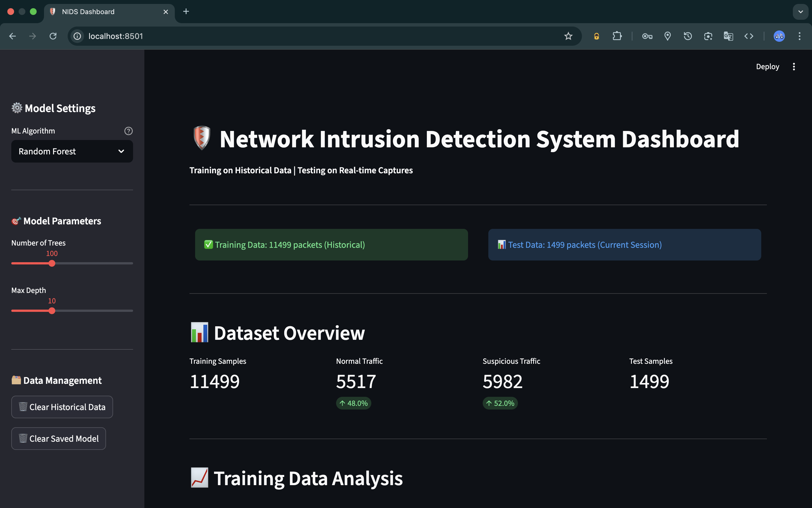
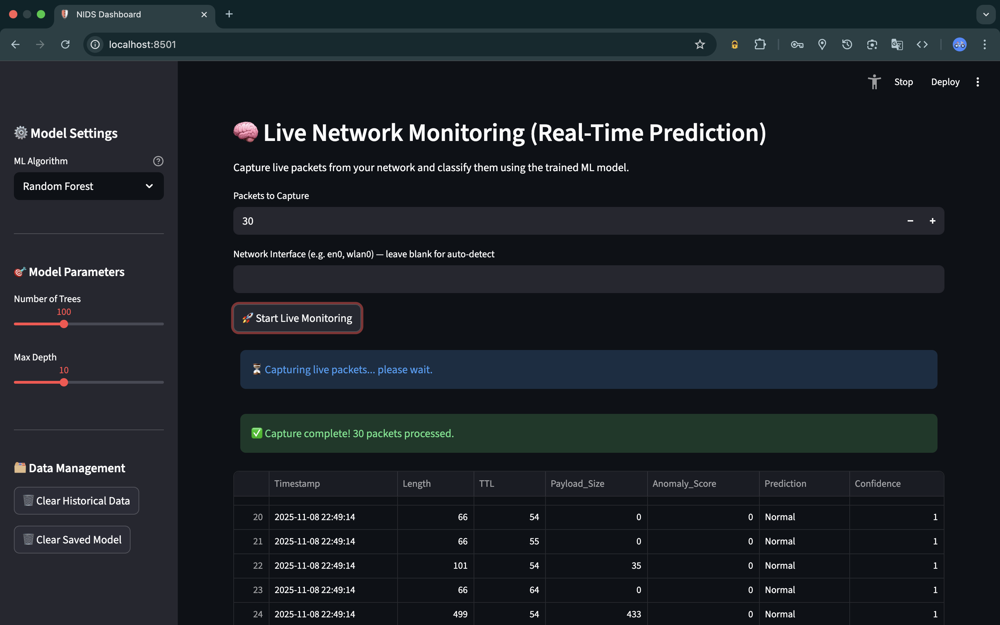
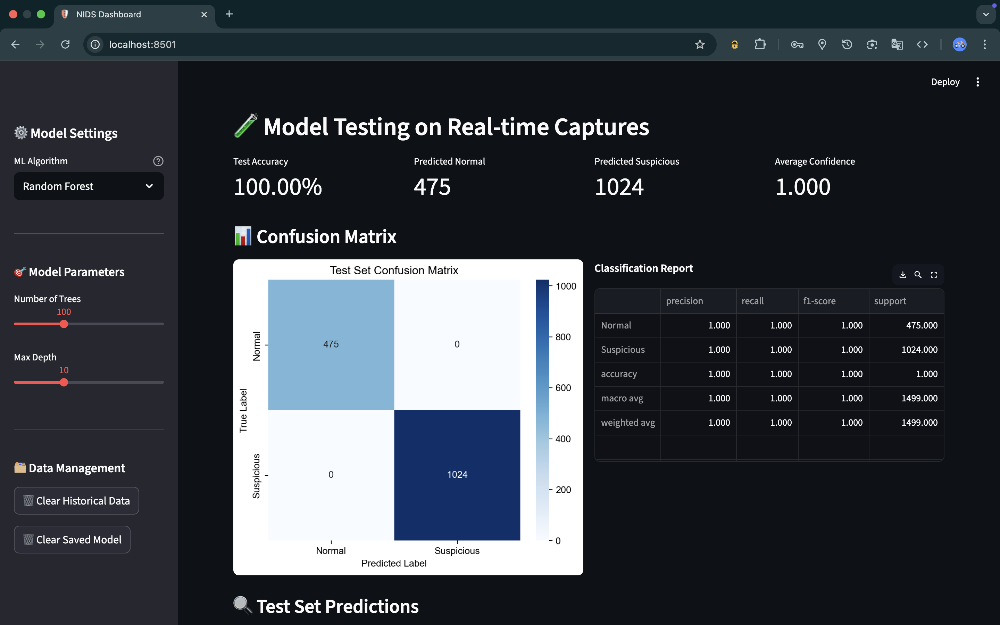
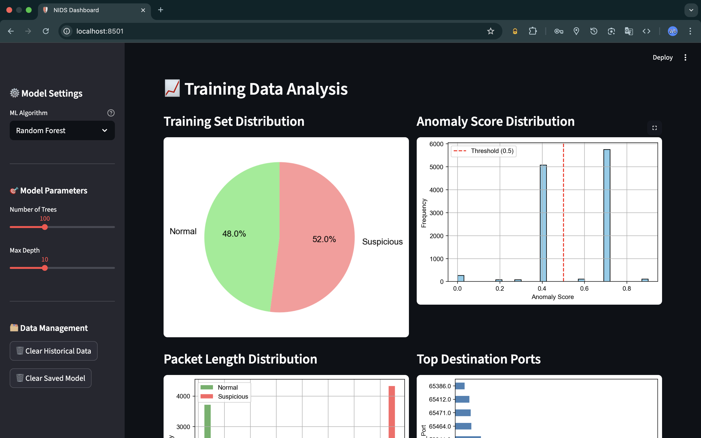
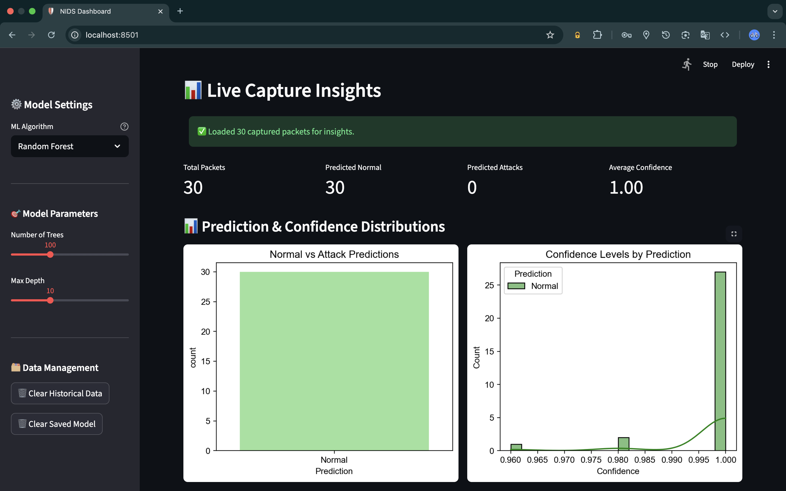

# 🛡️ Advanced Network Intrusion Detection System (NIDS)


> A real-time **Network Intrusion Detection System (NIDS)** built using **Python, Scapy, and Machine Learning** to detect and visualize malicious network activity.

---

## 📘 Project Overview

This project implements an **AI-based Intrusion Detection System** that captures live network packets, extracts key features, and uses **machine learning models** to identify suspicious or potentially malicious traffic patterns.

The system provides:
- 🔍 Real-time packet capture and logging  
- 🧠 Machine Learning–based intrusion detection  
- 📊 Interactive dashboard for data visualization and model metrics  
- 💾 Persistent storage of historical and live session data  

---

## 🧩 Key Features

- 🕵️ **Real-Time Packet Capture:** Uses `Scapy` to monitor network traffic.  
- 🧠 **AI/ML Detection Engine:** Detects anomalies using Random Forest, Decision Tree, and Logistic Regression models.  
- 📊 **Interactive Dashboard:** Streamlit-based interface to view live stats and retrain models.  
- 💾 **Data Persistence:** Saves and loads historical packet data for cumulative analysis.  
- ⚙️ **Configurable Parameters:** Adjustable model depth, number of estimators, and algorithm selection.  

---

## 🧠 Tech Stack

| Component | Technology |
|------------|-------------|
| Programming | Python 3.9+ |
| Networking | Scapy |
| Data Handling | Pandas, NumPy |
| Machine Learning | Scikit-learn |
| Visualization | Matplotlib, Seaborn |
| Dashboard | Streamlit |
| Storage | CSV Files |

---

## 📁 Folder Structure

```
Advanced_Network_Intrusion_Detection/
│
├── nids.py                # Core packet capture and feature extraction
├── dashboard.py           # Streamlit dashboard and ML logic
├── requirements.txt       # Project dependencies
│
├── data/                  # Datasets
│   ├── captured_data.csv
│   └── historical_data.csv
│
├── screenshots/
│   ├── dashboard.png
│   ├── live_capture_feature.png
│   ├── captured_data_analytics.png
│   ├── training_data_analytics.png
│   └── live_analytics.png
│
├── models/                # Trained models
│   ├── trained_model.pkl
│   └── scaler.pkl
│
├── LICENSE
└── README.md
```

---

## ⚙️ Installation & Setup

### 1️⃣ Clone the Repository
```bash
git clone https://github.com/<adars-h-agrawal>/advanced-network-intrusion-detection.git
cd advanced-network-intrusion-detection
```

### 2️⃣ Install Dependencies
```bash
pip install -r requirements.txt
```

### 3️⃣ Run the Packet Capture Script
> ⚠️ Requires admin/root privileges for sniffing.
```bash
sudo python nids.py
```

### 4️⃣ Launch the Dashboard
> ⚠️ Requires admin/root privileges for sniffing.
```bash
sudo streamlit run dashboard.py
```

---

## 🧪 Example Workflow

1. Run `nids.py` to capture live network packets.  
2. The data is stored in `data/captured_data.csv` and merged with historical data.  
3. Open the dashboard with `sudo streamlit run dashboard.py`.  
4. Choose an ML model (Random Forest / Decision Tree / Logistic Regression).  
5. View real-time metrics — accuracy, confusion matrix, feature importance.  
6. Use the sidebar to clear, retrain, or test new data.  

---

## 🖼️ Screenshots

<details>
  <summary>📸 Click to view screenshots</summary>

  <br>

  | Screenshot | Description |
  |-------------|-------------|
  |  | Streamlit main dashboard with live monitoring |
  |  | Real-time packet capture in action |
  |  | Statistical overview of captured packets |
  |  | Model training data distribution visualization |
  |  | Real-time ML performance analytics |

</details>

---

## 📊 Example Outputs

| Visualization | Description |
|----------------|-------------|
| 📈 Protocol Distribution | Shows counts of TCP, UDP, ICMP traffic |
| 🧮 Confusion Matrix | Displays model performance |
| 📉 Accuracy Trend | Monitors detection performance over time |
| 🧠 Feature Importance | Highlights key network parameters affecting prediction |

---

## 🧾 Requirements

```
pandas==2.2.2  
numpy==1.26.4  
matplotlib==3.9.0  
seaborn==0.13.2  
scikit-learn==1.5.0  
streamlit==1.37.0  
scapy==2.5.0
```

---

## 🧠 Machine Learning Details

- **Algorithms Used:**  
  - Random Forest  
  - Decision Tree  
  - Logistic Regression  

- **Data Split:**  
  - 80% training  
  - 20% testing  

- **Evaluation Metrics:**  
  - Accuracy Score  
  - Confusion Matrix  
  - Classification Report  

---

## 👩‍💻 Contributors

| Role | Member | Responsibilities |
|------|---------|------------------|
| Network & Data Engineer | Pranshu Singh | Packet capture, feature extraction, and data handling |
| ML & Dashboard Engineer | Adarsh Agrawal | Model design, training, evaluation, visualization, and documentation |


---

## 🧩 Future Enhancements

- Integration with **Deep Learning** for advanced anomaly detection  
- Multi-protocol support (ARP, DNS, HTTP)  
- Automated **threat response** and alert notifications  
- Integration with external APIs for live security threat feeds  

---

## 📜 License

This project is licensed under the MIT License — see the [LICENSE](LICENSE) file for details.

---

> _“Prevention is better than intrusion — stay secure, stay aware.”_
